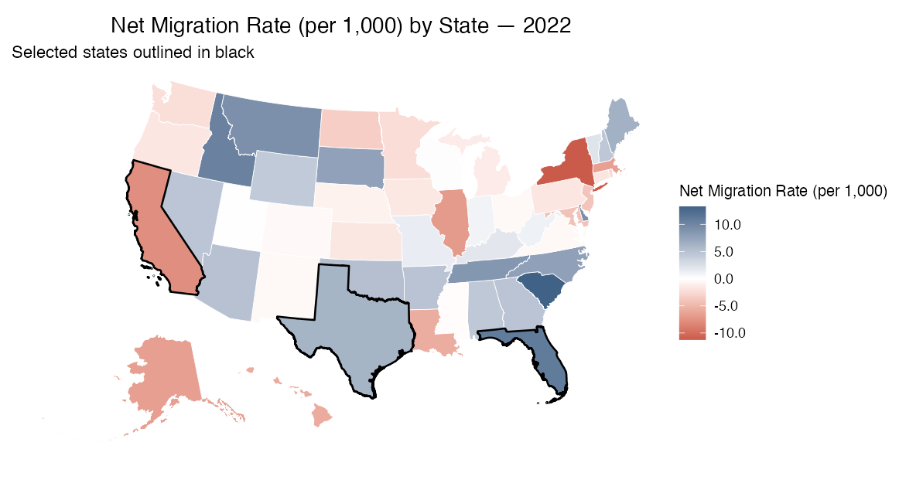
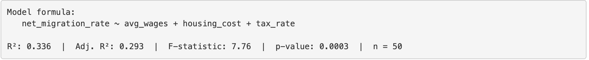
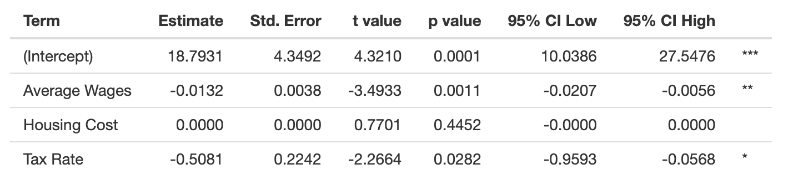
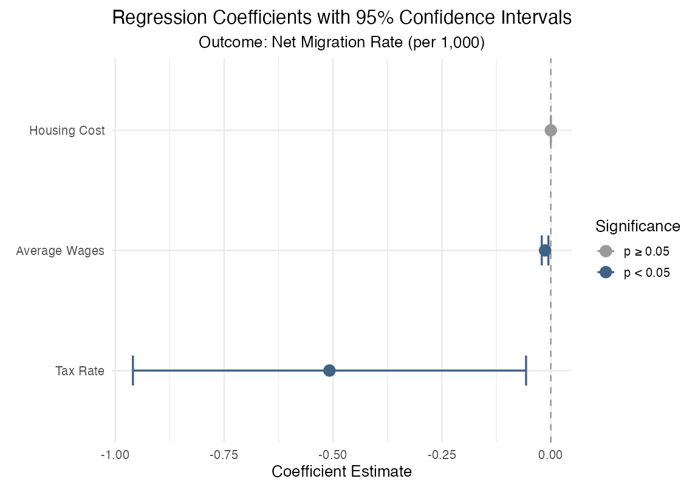
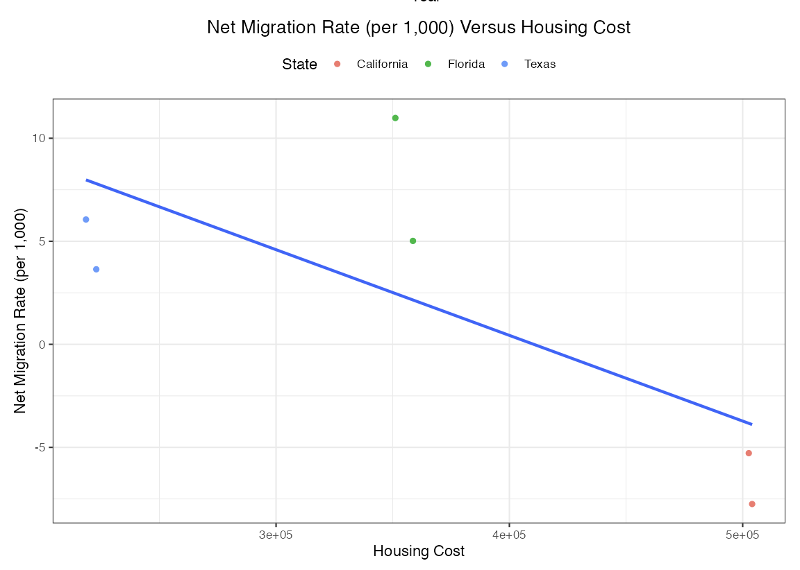

# Cost of Living and Migration Patterns

## Overview

This project is an interactive R Shiny application exploring relationships between U.S. state migration patterns and cost-of-living indicators, including housing costs, wages, unemployment, and tax rates.

The project was completed as part of DATA 613 at American University and coordinated through GitHub using a team-based workflow.

## Research Question

How are economic and cost-of-living indicators associated with state-level migration patterns in the United States?

## Tools and Skills

- R
- Shiny
- tidyverse
- ggplot2
- data cleaning and merging
- exploratory data analysis
- interactive visualization
- choropleth mapping
- regression/model exploration
- Git/GitHub collaboration

## Project Features

- Interactive state-level migration map
- Cost-of-living and economic indicator visualizations
- User-driven filters and exploratory controls
- Regression/model output summaries
- Filterable data tables
- Project vignette explaining the analysis and app workflow
  
## Key Takeaways

- Migration patterns appear to be associated with multiple cost-of-living and economic factors rather than any single indicator.
- Housing costs, income, employment conditions, and tax differences provide useful context for exploring why some states gain or lose residents.
- Interactive tools such as maps, scatterplots, model outputs, and data tables make it easier to explore state-level patterns and compare possible explanations.
- The project demonstrates how multi-source public datasets can be cleaned, merged, and presented in a user-friendly analytic application.

## Notes

This project is exploratory and should not be interpreted as a causal analysis. The app is designed to help users examine patterns and relationships between migration and cost-of-living indicators, not to determine why individuals or households moved.

The project was developed collaboratively as part of a graduate data science course. This portfolio version highlights the final app, project vignette, screenshots, and public-facing documentation.

## Repository Structure

```text
cost-of-living-migration-shiny/
├── App/
│   └── app.R
├── images/
│   ├── migration_map_screenshot.png
│   ├── scatterplot_screenshot.png
│   ├── regression_table_screenshot.png
│   ├── coefficient_plot_screenshot.png
│   └── model_fit_screenshot.png
├── vignette/
│   ├── vignette.qmd
│   └── vignette.html
└── README.md
```

## Links

- Portfolio: [Eric Ekman Data Science Portfolio](https://github.com/eekman0926/data-science-portfolio)
- Project Website: [View GitHub Pages site](https://eekman0926.github.io/cost-of-living-migration-shiny/)
- Project Vignette: [View rendered HTML vignette](https://eekman0926.github.io/cost-of-living-migration-shiny/vignette/vignette.html)
- App Code: [View app.R](App/app.R)
- Vignette Source: [View Quarto source](vignette/vignette.qmd)

## Screenshots

### Migration Map



### Model Fit



### Regression Table



### Coefficient Plot



### Scatterplot


